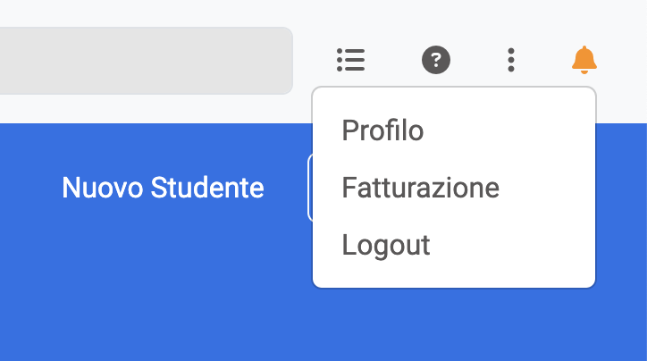
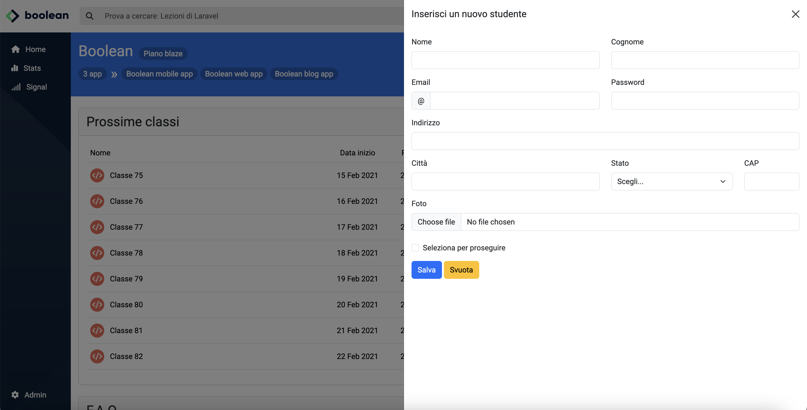
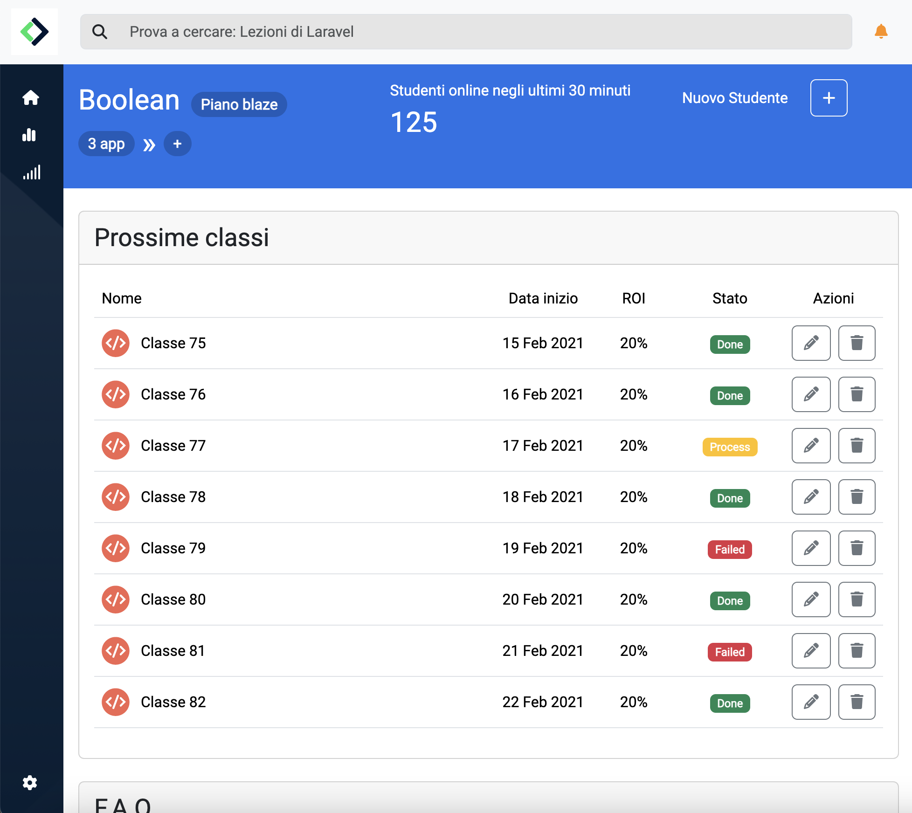
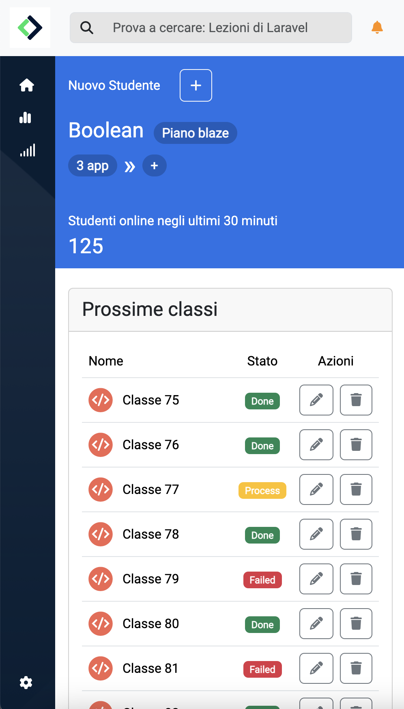

# Bootstrap Dashboard

This is a dashboard created as a bootcamp exercise using Bootstrap.  
It features a popup menu on click on the bell button:

As well as an off-canvas activated by clicking on the plus button labeled as "Nuovo Studente":

The dahsboard is responsive. It uses the Bootstrap breakpoints of 768px and 992px.  
This is the tablet view:

And this is how the dahsboard appears on mobile:

